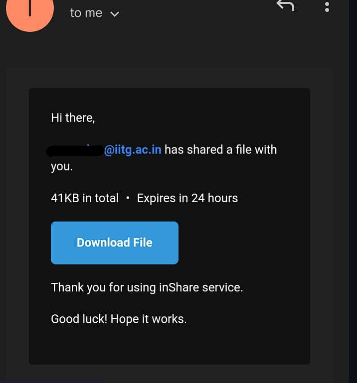

# ShareSphere: Seamless and Secure File Sharings🗃️
Welcome to **ShareSphere** – a modern, efficient, and secure file-sharing application designed to streamline the way you share and receive files across different platforms. ShareSphere combines ease of use, high performance, and robust security to deliver an unparalleled file-sharing experience.

### Key Features
1. 🚀 Fast Transfers: Experience rapid file transfers up to 100MB of file size.
2. 🌍 Cross-Platform Compatibility: Seamlessly share files between Windows, macOS, Linux, Android, and iOS.
3. 🎯 User-Friendly Interface: Intuitive design that makes it easy for everyone to send, receive, and manage files.
4. 📁 Multi-File Support: Effortlessly share documents, images, videos, and other file types.

## Frontend -
### Homepage

### Receiving Email -

### Backend -
1. Download Page ScreenShot
   

2. Email sent Success Message
   
